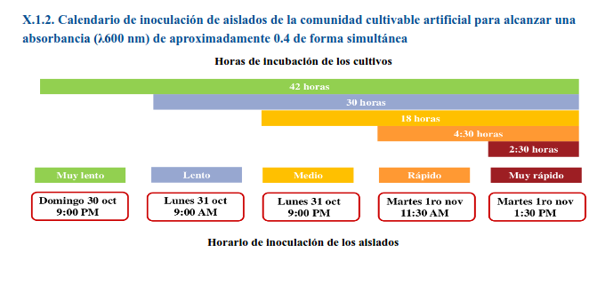
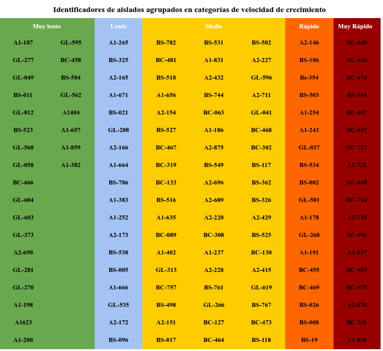

##1. Experimento de mesocosmos

Se le conoce también como experimento de "aclimatación y selección" .Esto bajo un contexto de ecología sintética/evolución 

Este experimento se lleva a cabo de la siguiente manera:

##### 1.1 Criterios de selección del experimento
- Se seleccionan aislados capaces de tolerar las condiciones del lugar de donde se aisló.

  - Para ello se investiga la concentración (en peso por ciento) del lugar, que inhibe el crecimiento de las  cepas que se utilizarán como control.
  - Esa misma concentración se utiliza para preparar un medio de cultivo selectivo para el experimento. (ver controles del experimento).

* Se seleccionan aislados capaces de utilizar moléculas que provienen de plantas, o se han reportado como exudado de raíces, como fuentes de carbono.
 - Para ello se utilizan  medios adecuados, dependiendo del tipo del lugar en donde se aisló.
 -  Por ejemplo, en este caso,se utilizó un medio compuesto por extracto de germinado de soya y medio LB adicionado de manitol (Ver carpeta de medios).
 - Se realizan 2 lineas experimentales.
 - Las lineas siguen el nombre del medio utilizado.
 - Estas se realizan por duplicado.

* El último criterio es seleccionar aislados que muestren capacidades de competencia (aislados agonistas y/o resistentes).

##### 1.2 Inoculación de la CCA

* Los aislados que se obtengan deben de ser inoculados siguiendo un calendario de inoculación, para realizar este mismo se siguen los siguientes pasos:
 
 1. Se realizan cinéticas de crecimiento de los aislados
 2. Cada aislado fue inoculado de forma independiente
 3. Se añade 100 µL del cultivo líquido en 1 mL de medio fresco (LB en este caso) en tubos de 2mL de capacidad.
 4. Los cultivos se incuban a 28°C y 150 rpm.
 5. Se colocan los tubos en una posición de 90°.
 6. Se mide la absorbancia (λ 600 nm)utilizando un espectofrotómetro Genesys 20 7.
 7. La absorbancia se mide a las 18,30 y 42 horas de incubación.
 8. Los aislados se agrupan en 5 grupos según su velocidad de crecimiento en medio líquido.
 9. De forma individual, se pican colonias con palillos de madera estéril.
 10. Se inoculan en tubos eppendorf con 1 mL de medio (LB en este caso).
 11. Los cultivos deben alcanzar una D.O (λ 600 nm).
 12.  400 µL de cada cultivo se inoculan en la linea correspondiente y 400 µL en la otra (dependiendo de cuantas lineas se tengan).
 13.  Cada linea debe de ir con 30 mL de medio de cultivo correspondiente.
 14.  Ambos matraces se mantienen en hielo.
 15.  Una vez que se inoculan todos los aislados los matraces se incuban a 28°C y 150 rpm.

 En ejemplo  de como se agrupan los aislados se ilustra a continuación:
 

 

##### 1.3 Pases seriales

1. Después de 48 h de incubación.
2. Los matraces se agitan vigorosamente.
3. Se transfiere 1 mL de cultivo a 30 mL de miedo fresco correspondiente a cada linea.
4. Este procedimiento de pases se realiza serialmente a 48 horas de incubación a 28°C y 70 rpm.

> Los primeros 8 días de incubación 8 (3 pases seriales) se  denominan etapa de aclimatación.
> A partir del cuarto pase se añade jal minero a los medios de cultivo (en este caso)

##### 1.4 Controles del experimento

1. Como primer control:
- Se incuba en un matraz Erlenmeyer 10mL de medio (el que se requiera) + la fuente necesaria (ej. manitol 3% m/v).
- Cada 48 h se pasa 1mL del medio anterior a 10mL de medio fresco.
- Se incuba y se monitorea.
2. Como segundo control:
- Se inoculan 100 mL del medio adecuado y se inoculan por goteo en el medio sólido.
- Se dejan secar las gotas por completo en la campana de flujo laminar.
- Se incuban a 28°C.

> Se repite el procedimiento cada vez que se realiza un pase serial.

